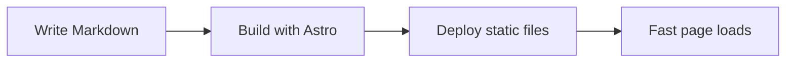

Markdown is the fastest way to write content for the web. Astro makes that content feel like a modern application.

## Why Astro + Markdown

Astro gives you the best of both worlds: static generation at build time and the option to add interactive islands where you need them. For a blog or portfolio, most pages are static, so the default path is perfect.

## Content collections

Astro content collections add a typed layer to Markdown. The schema is defined with Zod:

```ts
import { defineCollection, z } from "astro:content"

const articles = defineCollection({
  schema: z.object({
    title: z.string(),
    description: z.string(),
    publishDate: z.coerce.date(),
    tags: z.array(z.string()).default([]),
  }),
})
```

This catches frontmatter mistakes before the build.

## A table of SSG options

| Feature | Astro | Next.js | Gatsby |
|---|---|---|---|
| Static output | Yes | Yes | Yes |
| Partial hydration | Islands | SSR | Gatsby 5 |
| Content collections | Yes | No | No |
| Markdown-first | Yes | Optional | Plugins |

## Diagrams with Mermaid



## Conclusion

If your content lives in Markdown, Astro is the fastest route to a production-grade site.
